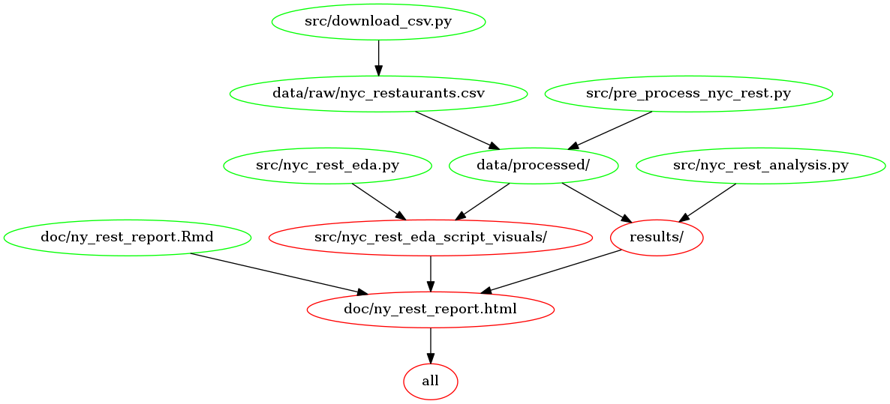

# Predicting the Grade of Restaurants in New York City

- Authors (ordered alphabetically by last name) from Group 18:
    - Nikita Susan Easow
    - Sneha Sunil
    - Edward (Yukun) Zhang
    - Lauren Zung

A data analysis project for DSCI 522 (Data Science workflows); a
course in the Master of Data Science program at the University of
British Columbia.

URL of the project repo: https://github.com/UBC-MDS/newyork_restaurant_grading.git

## Project Summary

In this project, we build a classification model using logistic regression and support vector machines which uses health inspection data to predict whether a restaurant will be graded A (i.e., the restaurant is clean, up to code, and free of violations.) or F (i.e., the restaurant has some issues that must be fixed or is a public risk on the verge of closure).

Our best model was a balanced logistic regressor with a C value of 0.024947, 1 numeric feature, 130 text features and 47 categorical features. On a test set of 10000 samples, we returned an F1 score of 0.999 and precision and recall scores of 0.999 and 0.999 respectively, indicating that our model is highly effective at classifying both grade A and F restaurants. We also computed the area under a receiver operating characteristic curve which was found to be 1.00. This is the optimum value which also supports that the predictions from our model are close to 100% correct.

We chose the data set, DOHMH New York City Restaurant Inspection Results sourced from NYC OpenData Portal. It is retrieved from the tidytuesday repository by Thomas Mock, and can be sourced here. The original data set can be found here. It contains the violation citations from every inspection conducted for restaurants in New York City from 2012 to 2018. Each row represents a restaurant that has been assessed by a health inspector, including information about their business such as the restaurant name, phone number, location and type of cuisine, as well as the details about their inspection. The restaurants can be assigned an official grade of A, B, or C, otherwise they are assigned Z or P for pending review.
## Report

[Here](https://ubc-mds.github.io/newyork_restaurant_grading/doc/ny_rest_report.html) is the link to the Project Report.

## Usage

To replicate this analysis, clone this GitHub repository and download the environment found [here](https://github.com/UBC-MDS/newyork_restaurant_grading/blob/main/environment.yaml) to install the necessary [dependencies](#dependencies).


1. Clone the repository
    
    ```
    git clone https://github.com/UBC-MDS/newyork_restaurant_grading.git
    ```

2. Navigate to the repository

    ```
    cd newyork_restaurant_grading
    ```
    
## Run the Analysis using MAKE file 

To run the analysis using MAKE file, follow the below instructions -

1. Create the environment

    ```conda env create -f environment.yaml```

    Assuming that the environment was created successfully, you can activate the environment as follows:

    ```conda activate nyc_rest```
    
2. To run the entire data analysis easily, use the following commands at the command line/terminal from the root directory of this project:

    ```make all```
    
   To reset the repository to a clean state, with no intermediate or results files, run the following command :

    ```make clean```
    
## Run the Analysis using Docker

To run the analysis using a docker image, follow the below instructions -

1. Install [Docker](https://docs.docker.com/get-docker/)

2. Pull the docker image

    ```docker pull lzung/newyork_restaurant_grading```
   
3. After pulling the image, run the below command depending on your Operating system :

  For `Windows` OS :
  
    docker run --rm -v "/$(pwd)://home//newyork_restaurant_grading" lzung/newyork_restaurant_grading:latest make -C //home//newyork_restaurant_grading all
  
  To reset the results which are already present, run the following command :
  
    docker run --rm -v "/$(pwd)://home//newyork_restaurant_grading" lzung/newyork_restaurant_grading:latest make -C //home//newyork_restaurant_grading clean
  
  For `Mac` OS : 
  
    docker run --rm -it --platform linux/amd64 -v /$(pwd):/home/newyork_restaurant_grading lzung/newyork_restaurant_grading make -C /home/newyork_restaurant_grading all
  
  To reset the results which are already present, run the following command :
  
    docker run --rm -it --platform linux/amd64 -v /$(pwd):/home/newyork_restaurant_grading lzung/newyork_restaurant_grading make -C /home/newyork_restaurant_grading clean


## Makefile Dependency Diagram


Click the image to enlarge for better visibility:


## Dependencies

The associated environment with all dependencies required for this project can be found [here](https://github.com/UBC-MDS/newyork_restaurant_grading/blob/main/environment.yaml).

- python==3.9.*
- ipykernel
- ipython>=7.15
- vega_datasets=0.9.0
- altair_saver
- selenium<4.3.0
- scikit-learn>=1.0
- pandas>=1.3.*
- requests>=2.24.0
- dataframe_image=0.1.1
- scipy=1.9.3
- matplotlib=3.6.2
- matplotlib-base=3.6.2
- matplotlib-inline=0.1.6
- pip:
  - docopt-ng==0.8.*
  - joblib==1.1.0
  - mglearn
  - psutil>=5.7.2
  - vl-convert-python==0.5.0
  - lxml

## License

The New York City Restaurant dataset was adapted from tidytuesday dataset
made available under the license **Creative Commons Zero v1.0 Universal** 
which was originally taken from the Department of Health and Mental Hygiene (DOHMH)
owned by NYC OpenData.

For more details about the License of this project, please click [here](https://github.com/UBC-MDS/newyork_restaurant_grading/blob/main/LICENSE).

## References

<div id="refs" class="references hanging-indent">

<div id="ref-Mock2022">

Mock, T (2022). Tidy Tuesday: A weekly data project aimed at the R ecosystem. https://github.com/rfordatascience/tidytuesday.

</div>

<div id="ref-NYCOpen">

NYC Open Data Portal (2022). DOHMH New York City Restaurant Inspection Results.
https://data.cityofnewyork.us/Health/DOHMH-New-York-City-Restaurant-Inspection-Results/43nn-pn8j/data

</div>
    
<div id="ref-SmartSense">
    
SmartSense. (2018, August 17). Restaurant letter grading: What does a B really mean? Connected Insights Blog. Retrieved November 19, 2022, from https://blog.smartsense.co/restaurant-letter-grading#:~:text=GRADE%20A%3A%20The%20restaurant%20is,and%20on%20verge%20of%20closure. 

</div>
    
<div id="ref-EaterNY">
    
Staff, E. (2020, June 10). A running list of new restaurants that opened during the pandemic. Eater NY. Retrieved November 19, 2022, from https://ny.eater.com/2020/6/10/21270665/nyc-new-restaurant-openings-coronavirus 

</div>
    
</div>
