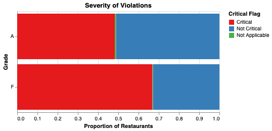

# The Prediction of New York City Restaurant Grading 

  - authors (ordered alphabetically by last name) from Group 18:
    Nikita Susan Easow, Sneha Sunil, Edward (Yukun) Zhang, Lauren Zung
  

A data analysis project for DSCI 522 (Data Science workflows); a
course in the Master of Data Science program at the University of
British Columbia.

URL of the project repo: https://github.com/UBC-MDS/newyork_restaurant_grading.git

## Project Proposal

We choose the large dataset DOHMH New York City Restaurant Inspection Results sourced from 
NYC OpenData Portal. It is retrieved from the tidytuesday repository by Thomas Mock, 
and can be sourced [here](https://github.com/rfordatascience/tidytuesday/tree/master/data/2018/2018-12-1.).
The original data set can be found [here](https://data.cityofnewyork.us/Health/DOHMH-New-York-City-Restaurant-Inspection-Results/43nn-pn8j/data).
It contains the violation citations from every inspection conducted for restaurants in New York City from 2012 to 2018. 
Each row represents a restaurant that has been assessed by a health inspector, 
including information about their business such as the restaurant name, phone number, location (borough, building number, street, zip code) 
and type of cuisine, as well as the details about their inspection 
(e.g. date, violation code, description, whether there were any violations cited, whether they were critical, etc.). 
The restaurants can be assigned an official grade of A, B, or C, otherwise they are assigned Z or P for pending review.

As data scientists, we are interested in predicting the restaurant grading in New York City
based on our target of adjusted grading standards (Grade A and Grade F). During the exploratory data analysis (EDA)
process, we notice the target inherently has a large class imbalance property so we formulate our predictive problem 
as a binary classification by combining Grade B/C as Grade F and drop the restaurants with "pending" grades from our analysis.
As we can see from the the below table, there are 300,000 inspections logged in the data set, but only 151,451 of them have a value assigned to the grade column. 
149,885 of them have been assigned grades as the following table:

|Grade|Number of Inspections|
|----------:|--------------:|
|A (Grade A)|119647|
|B (Grade B)|19215|
|C (Grade C)|5888|
|Z (Grade Pending)|3316|
|P (Grade Pending issued closure)|1819|

**Table 1.** Counts of inspections belonging to each class.

Additionally, from the above table we have restaurants with "pending" grades. 
We will keep these out of our analysis to use as deployment data, where we will see if we can categorize them as either A or F based on their feature values.

Furthermore, we would like to graphically explore the relations between features and the target in order to choose our features properly. 
Considering the data attributes, we would expect the score and critical flag assigned to an inspection to be good predictors of whether the restaurant will be graded A or not. 
Thus, we have plotted their distributions by class to investigate whether our assumptions are true or not:


**Figure 1.** Boxplot of the distribution of inspection scores across grades. Green represents Grade A restaurants and orange represents Grade F (below Grade A) restaurants.

It seems that Grade F restaurants are associated with higher scores on average, though some Grade F inspections also received low scores (nearly 10,000 are < 20). 
We can interpret the score as being higher for more severe/critical health violations, but there does not seem to be a standard cut-off for when a restaurant is considered Grade A or not.



**Figure 2.** Proportion of restaurants that received critical (red) and non-critical (blue) violations by grade. Violations that are unclassified received a 'Not Applicable' flag (green).

We observe a similar relationship with the assignment of critical flags. Grade F restaurants receive proportionately more critical flags as expected, 
though almost 50% of Grade A restaurants had critical violations during their inspection! 
It is not clear what the threshold for a "critical" violation is, thus it will be interesting to see whether our model(s) can identify if the severity of a violation actually matters for grading.

For more details about all the figures and tables in this project, please click [here](https://github.com/UBC-MDS/newyork_restaurant_grading/src)

We plan to fit several supervised machine learning classification models (KNN, Logistic Regression, SVM and so on),
and then collect and compare the results across multiple error measurement metrics 
and visualize the modeling results as tables and graphs to generate the report. 

This project has very meaningful implications since as consumers, we care about the overall safety of the 
restaurants and if a restaurant can be accurately predicted as "bad", then we can safely avoid eating there.
Moreover, if we are able to generalize our model for other large cities across the world, 
then this data analysis report would have great values for local residents and tourists. 


## Report

This will be updated once the project is finished. 

## Usage

There is one suggested way to run this analysis:

To replicate the analysis, clone this GitHub repository, install the
[dependencies](##Dependencies) listed below, and run the following
command at the command line/terminal from the root directory of this
project:
1. Clone the repository
    ```
    git clone git@github.com:UBC-MDS/newyork_restaurant_grading.git
    ```
    
    or
    
    ```
    git clone https://github.com/UBC-MDS/newyork_restaurant_grading.git
    ```

2. Navigate to the repository

    ```
    cd newyork_restaurant_grading
    ```

3. Create the environment

    ```conda env create -f environment.yaml```

    Assuming that the environment was created successfully, you can activate the environment as follows:

    ```conda activate nyc_rest```

4. Download the data

    ```python src/download_csv.py --input_url="https://raw.githubusercontent.com/rfordatascience/tidytuesday/master/data/2018/2018-12-11/nyc_restaurants.csv" --output_file="./data/raw/nyc_restaurants.csv"```

 

## Dependencies

Note: more packages are likely to be added in future updates/milestones.

  - Channels:
      - conda-forge
      - defaults
  - Dependencies:
      - docopt=0.6.2
      - ipykernel
      - ipython>=7.15
      - vega_datasets
      - altair_saver
      - selenium<4.3.0
      - matplotlib>=3.2.2
      - scikit-learn>=1.0
      - pandas>=1.3.*
      - requests>=2.24.0
      - pip:
        - joblib==1.1.0
        - mglearn
        - psutil>=5.7.2


## License

From the LICENSE.md file.

## References

<div id="refs" class="references hanging-indent">

<div id="ref-Dua2019">

Mock, T (2022). Tidy Tuesday: A weekly data project aimed at the R ecosystem. https://github.com/rfordatascience/tidytuesday.

</div>

<div id="ref-Streetetal">

NYC Open Data Portal (2022). DOHMH New York City Restaurant Inspection Results.
https://data.cityofnewyork.us/Health/DOHMH-New-York-City-Restaurant-Inspection-Results/43nn-pn8j/data

</div>

</div>
