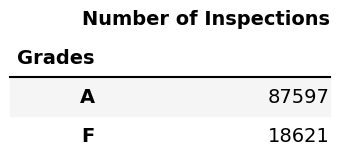
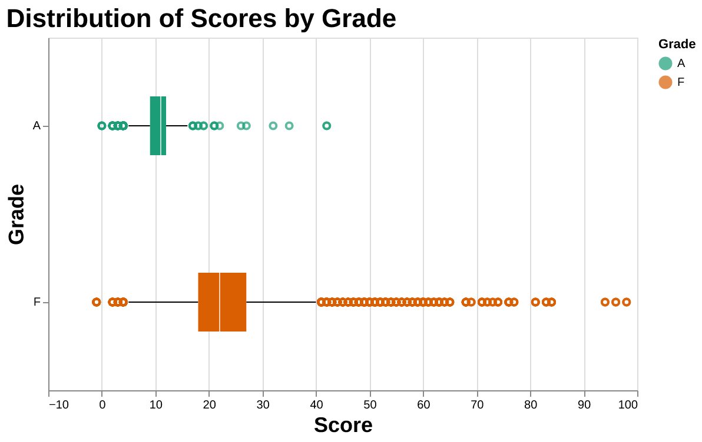
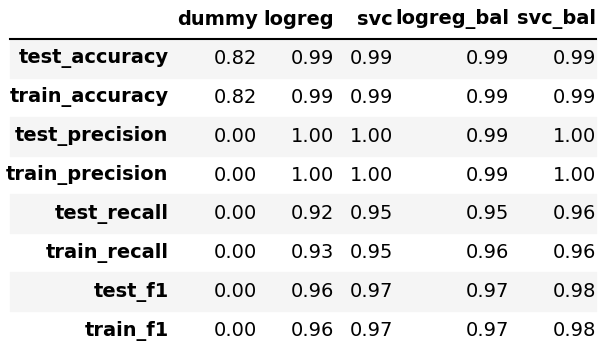
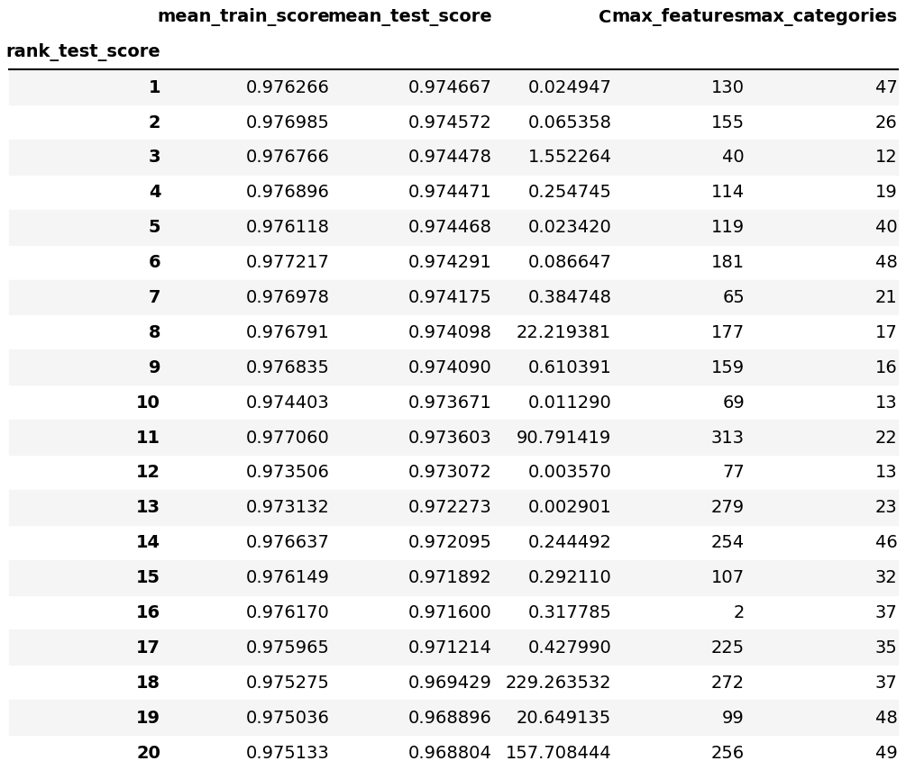
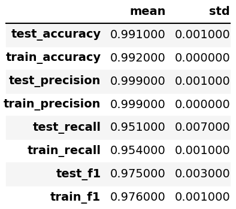

```{r setup, include=FALSE}
knitr::opts_chunk$set(echo = FALSE)
library(tidyverse)
library(knitr)
library(kableExtra)
```


This is a data analysis project for DSCI 522 (Data Science workflows); a course in the Master of Data Science program at the University of British Columbia.

## Contributors

- Nikita Susan Easow
- Sneha Sunil
- Edward (Yukun) Zhang
- Lauren Zung

## Introduction

After the state proclaimed the restoration of indoor dining during the COVID 19 era, hundreds of new restaurants have opened throughout New York City (Eater NY, 2020).
Now that things are getting back to normal as the restrictions set by government are lifted and people are returning back to dining out as the hotel sector reopens, the general safety of restaurants has taken on utmost importance in light of the current state of affairs of COVID.
The standards that health inspectors use for grading will probably need to be revised because health rules have become more stringent in order to curb the pandemic.
The overall plan used by health inspection is as follows, though it may vary by state:

- **GRADE A:** The restaurant is clean, up to code, and free of violations.
- **GRADE B:** The restaurant has some issues that must be fixed.
- **GRADE C:** The restaurant is a public risk and on verge of closure.

(Source: SmartSense, 2018)

As data scientists, we're curious about how we can evaluate and predict a restaurant's general level of quality so that we can provide recommendation on the right restaurants which can be dined in safely by classifying the restaurant as "good" or "poor" (in our case, Grade A vs.Grade B/C).
As we have access to restaurant data for the New York City, we would like to concentrate our analysis on forecasting the grading of restaurants as Good or Poor for specific NYC locations, with plans to eventually expand to other metropolitan regions.
We believe that our effort could be useful to the residents or tourists in the NY city and this could be a one stop solution for people who are looking to dine in without having to worry about the quality.

**Research question :**

`Can we predict the grade for a restaurant (Grade A or F) given different metrics describing their health violations during a routine inspection?`

Besides this main research question, our analysis would also like to address some interesting sub-questions given below:

- Which cuisines are more likely to be graded A in NYC?
- Which cuisines are more likely to be graded B or C in NYC?
- Which borough in NYC seems to have the best restaurants?
- Which borough in NYC seems to have the most restaurants with the most severe violations?
- What words in a violation description contribute most to whether a restaurant is graded A or B/C?

## Data

The data set that we are using in our analysis for the restaurant grading, DOHMH New York City Restaurant Inspection Results, is sourced from NYC OpenData Portal.
It was obtained from the tidytuesday [repository](https://github.com/rfordatascience/tidytuesday/tree/master/data/2018/2018-12-11) by Thomas Mock.
The original data set can be found [here](https://data.cityofnewyork.us/Health/DOHMH-New-York-City-Restaurant-Inspection-Results/43nn-pn8j/data).

**Summary - **

The data includes all of the violation citation from the restaurant inspections held in New York City from 2012 to 2018.
Each row represents a restaurant that has undergone a health inspection which has the information about each establishment including the restaurant name, phone number, location (borough, building number, street, zip code), cuisine type, and also the details about the inspection itself which includes date, violation code, description, whether there were any violations cited, whether they were critical, etc.).
The restaurants may receive an official grading of A, B, or C; alternatively, they may receive a Z or P for an evaluation that is still pending.
Here is a complete dictionary of the data can be found [here](https://github.com/rfordatascience/tidytuesday/tree/master/data/2018/2018-12-11#data-dictionary).

## Exploratory Data Analysis

We performed the exploratory data analysis on the restaurant dataset and we noticed that the total strength of inspections were 3,00,000, out of which only 151,451 had a value filled in for the grade column that we are interested in.


```{r out.width = '35%', out.height = '25%'}
 
```


As we can see from the above table, there is a significant class imbalance of which 79.8% inspections are graded as A.
Hence, we've chosen to approach our research question as a binary classification problem , where the outcome will determine whether a restaurant should be graded as A(Pass) or F(Fail - clubbing the B and C grades) based on the standards that are set.
We have excluded the restaurants with "PENDING" grade and will be considering in the deployment data in order to predict the grade using our model.

We performed the rest our analysis on the training data where we split the initial data set such that 75% of the data will go to our train data and the rest 25% will be for validating the performance of the model on restaurants which hasn't been graded yet based on the inspection features that we have.

One important point to note here is that when we grouped the restaurants by `camis` feature, we could see that many restaurants were inspected more than once and we are not sure on whether the restaurants share the same name or if some restaurants have changes their name in between 2012 and 2018.
Since we could not incorporate this issue while modelling, we have added it to the limitations.


**Fig 1 :**

```{r out.width = '60%', out.height = '25%'}
 
```


From the above plot, we can see that the grade F restaurants are associated with higher scores on an average when compared to that of the graded A restaurants even though some of them have low scores.
We can conclude that the scores are higher for more critical health violations, but we cannot generalize as we do not see a hard cut off for when a restaurant is graded A or not.

**Fig 2 :**

```{r out.width = '60%', out.height = '25%'}
knitr::include_graphics("../src/nyc_rest_eda_script_visuals/critical_flag_stacked.png")
```


In the above figure, the plot suggests that the Grade F restaurants receive proportionally more red flags related to violations than Grade A restaurants do, but it is interesting to see that even grade A restaurants have had some critical violations.
It will be intriguing to see if our model can determine whether the seriousness of a violation actually counts for grading because it is unclear what the threshold for a "major" violation is.


**Fig 3 :**

```{r out.width = '60%', out.height = '25%'}

```

We should be able to dine in any neighborhood of NYC because all of the boroughs have a majority of Grade A restaurants.
It is clear that the majority of the inspections took place in Manhattan, which also has the highest concentration of restaurants receiving a Grade F rating among the other boroughs.

The complete EDA including the above figures and tables can be found [here](https://github.com/UBC-MDS/newyork_restaurant_grading/blob/main/src/nyc_rest_eda.ipynb).

## Interpretation of the Results & Discussion

Considering our research question is a binary classification model, we picked two different models to perform training using our data - `Logistic regression` (balanced and imbalanced)
and `Support vector machines` (balanced and imbalanced). In addition to this, our trained models are also compared against a baseline model `Dummy classifier ` so we could measure how our models performed.

**Note** - We downsampled our data from 150,000 observations to 30,000 data points in order to reduce the training time. 

As we can see from the below table, all models are performing better than the baseline model. In light of our data set's class imbalance, we expected the balanced models to perform better in cross validation. Comparing the scores of each model, we can see that the balanced are doing much better than their counterparts. In addition to that, the validation scores of the logistic regression model is higher than that of the support vector model. Hence we choose the balanced logistic regression as our classifier to train the dataset. Additionally, the logistic regression model's validation scores are higher than that of the support vector model. Hence, we chose the `Balanced Logistic Regression` as our classifier to train the data set.


```{r '60%', out.height = '25%'}

```


**Hyper parameter tuning results on logreg - **

```{r out.width = '100%'}

```


By using Random Search CV, we optimized the hyper parameters of the balanced logistic regression model to the following :

- **C** - 22.219381

- **max_features** - 177 

- **max_categories** - 17


**Train/validation scores from the best model - **

After performing cross validation on the training set using our optimized hyper parameters for our model, we got a good f1 score of 0.996. Both the precision and recall scores for the validation set is high, indicating that the model is accurate about its prediction (whether a restaurant will receive an F grade or not). The model is also able to identify all the restaurants (or 99% of the restaurants) that actually have received an F grade.

```{r out.width = '30%', out.height = '25%'}

```


**Classification report from the best model on the test set - ** 


```{r out.width = '50%', out.height = '25%'}

```


**Confusion matrices from the best model on train and test set**

```{r out.width = '50%', out.height = '30%'}

```


**PR curve from test set - **

The below PR curve depicts that if we keep the threshold as 0.5, we have an optimum solution with high precision and high recall value. If this threshold is lowered, the recall score also could get lesser and we may not be successful in classifying the restaurants correctly to the GRADE F class. 

```{r out.width = '50%', out.height = '30%'}


```


**ROC curve from test set - **

The ROC curve is a plot between the False Positive Rate and the True Positive Rate. Through this graph we find the area under the curve (AUC) is 1.00. This is the optimum value for an AUC and tells us that the predictions from our model are 100% correct.

```{r out.width = '50%', out.height = '30%'}

```

**NOTE on high f1 score - **

We are aware of the fact that f1 precision and recall score of our model on the train, validation and test sets are quite high. This may be because there are underlying linear relationships between different features and the target.

## Assumptions

In our data analysis, we are making the following assumptions -

-   The restaurants' data set that we have is a good enough representative sample of the restaurant population in New York.
-   The data is sourced ethically and is collected in a fair manner.
-   There is no bias in the data that is collected.
-   Grading is not affected by any external factors during the inspection.

## Limitations

The EDA shows that many of the restaurants have undergone inspections more than once, with the help of the `camis` feature. But, it is unclear whether some restaurants share the same name, or if some restaurants have changed their name between 2012 and 2018. Unfortunately, we were unable to parse the data by this feature to ensure that the restaurants that are reviewed more than once are not included both in the training and validation/test sets. Since we aren't sure whether the models are in fact learning the 'features' or the specific restaurant examples, there might be some discrepancies in the prediction results. We also had to downsample our training data set in order to reduce the training time as we are in short of computational resources.

## Statement of Future Directions

- Going forward, we would be considering only unique restaurants for training the model by dropping all duplicate inspections having matching `camis` features and performing predictions using the new model for other cities.
- As we progress with the research, we intend to use several models to compare different metrics and choose the best-suited model for our research problem.
- Additionally, we are also planning to make use of the deployment data and predict the grade of the restaurants using our model and compare this to the actual grading by the inspection team.
- In addition to New York, we could also generalize our model to predict the restaurant grading across other metropolitan cities.
- Lastly, we would like to incorporate certain feature engineering techniques like text-based engineering so that our model can be trained with the best features and yield better results.

## References

@tidytuesday
@scikit-learn
@cortes1995support
@Python 
@mckinney2011pandas
@docopt
@docoptpython
@knitr
@anaconda Software Distribution
@PER-GRA:2007
@VanderPlas2018
@cox1958regression
@Hunter:2007
