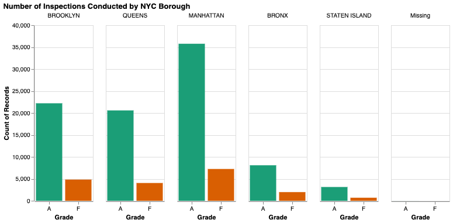

Exploratory Data Analysis of the NYC Restaurant Inspections Data Set
==========================

# Summary of the Data

The data set, DOHMH New York City Restaurant Inspection Results, used in this project is sourced from NYC OpenData Portal. It was sourced from the `tidytuesday` repository by Thomas Mock, and can be sourced [here](https://github.com/rfordatascience/tidytuesday/tree/master/data/2018/2018-12-1.). The original data set can be found [here](https://data.cityofnewyork.us/Health/DOHMH-New-York-City-Restaurant-Inspection-Results/43nn-pn8j/data).

It contains the violation citations from every inspection conducted for restaurants in New York City from 2012-2018. Each row represents a restaurant that has been assessed by a health inspector, including information about their business such as the restaurant name, phone number, location (borough, building number, street, zip code) and type of cuisine, as well as the details about their inspection (e.g. date, violation code, description, whether there were any violations cited, whether they were critical, etc.). The restaurants can be assigned an official grade of A, B, or C, otherwise they are assigned Z or P for pending review.

# Data Cleaning & Target

There are 300,000 inspections logged in the data set, but only 151,451 of them have a value assigned to the `grade` column. 149,885 of them have been assigned grades as follows:

|A (Grade A)|B (Grade B)|C (Grade C)|Z (Grade Pending)|P (Grade Pending issued on re-opening following an initial inspection that resulted in a closure)|
|----------:|----------:|----------:|----------------:|----------------:|
|119647|19215|5888|3316|1819|

Table 1. Counts of inspections belonging to each class.

There is a large class imbalance (79.8% of inspections are graded as A, thankfully). Thus, we have decided to conduct our analysis as a binary classification problem, where we are interested in determining whether a restaurant passes or fails according to our standards - Grade A vs everything else (Grade F)! We are more interested in predicting if a restaurant will receive below an A grade/no grade (uncertain quality), so that we can safely avoid eating there. Therefore, we will have to perform further processing during our analysis to overcome the discrepancy (i.e. increasing the importance of the Grade F class).

# Splitting the Data

Prior to the rest of the analysis, we will divide the data such that 75% of the inspections will be used to train our model(s) and 25% will be for testing to assess performance on unseen restaurants and determine whether our model will generalize well.

| Data Partition | Grade A | Grade F |
|---------------:|--------:|--------:|
|Train           |89789    |22624    |
|Test            |29858    |7614     |

Table 2. Counts of inspections belonging to each class in the training and testing sets.

# Exploring the Training Set

Considering the data attributes, we would expect the score and critical flag assigned to an inspection would be good predictors of whether the restaurant will be graded A or not. Thus, we have plotted their distributions by class to investigate whether our assumptions are true:

Figure 1. Histograms and density plots of the distribution of inspection scores across grades. Green represents Grade A restaurants and orange represents Grade F (below Grade A) restaurants.

It seems that Grade F restaurants are associated with higher scores on average, though some Grade F inspections also received low scores (nearly 10,000 are < 20). We can interpret the score as being higher for more severe/critical health violations, but there does not seem to be a standard cut-off for when a restaurant is considered Grade A or not.

Figure 2. Proportion of restaurants that received critical (red) and non-critical (blue) violations by grade. Violations that are unclassified received a 'Not Applicable' flag (green).

We observe a similar relationship with the assignment of critical flags. Grade F restaurants receive proportionately more critical flags as expected, though almost 50% of Grade A restaurants had critical violations during their inspection! It is not clear what the threshold for a "critical" violation is, thus it will be interesting to see whether our model(s) can identify if the severity of a violation actually matters for grading.

Figure 3. Number of inspections performed in each NYC borough by grade, where green represents Grade A and orange represents Grade F. The 'Missing' category contains 8 records which are all Grade A.

Each of the NYC boroughs contain mostly Grade A restaurants, thus we should be able to safely eat in any area. We can see that most of the inspections were conducted in Manhattan, which also has the most Grade F restaurants compared to all the other boroughs.

|Cuisine Description|Count of Records|
|------------------:|---------------:|
|American|                                                            25312|
|Chinese|                                                             11476|
|Cafe/Coffee/Tea|                                                      5832|
|Pizza|                                                                5049|
|Italian|                                                              4610|
|Latin (Cuban, Dominican, Puerto Rican, South & Central American)|     4566|
|Mexican|                                                              4275|
|Japanese|                                                             3891|
|Caribbean|                                                            3506|
|Bakery|                                                               3427|

Table 3. Number of inspections performed for the top 10 most common cuisine types.

# References

Mock, T (2022). *Tidy Tuesday: A weekly data project aimed at the R ecosystem.* https://github.com/rfordatascience/tidytuesday.

NYC Open Data Portal (2022). *DOHMH New York City Restaurant Inspection Results.* https://data.cityofnewyork.us/Health/DOHMH-New-York-City-Restaurant-Inspection-Results/43nn-pn8j/data